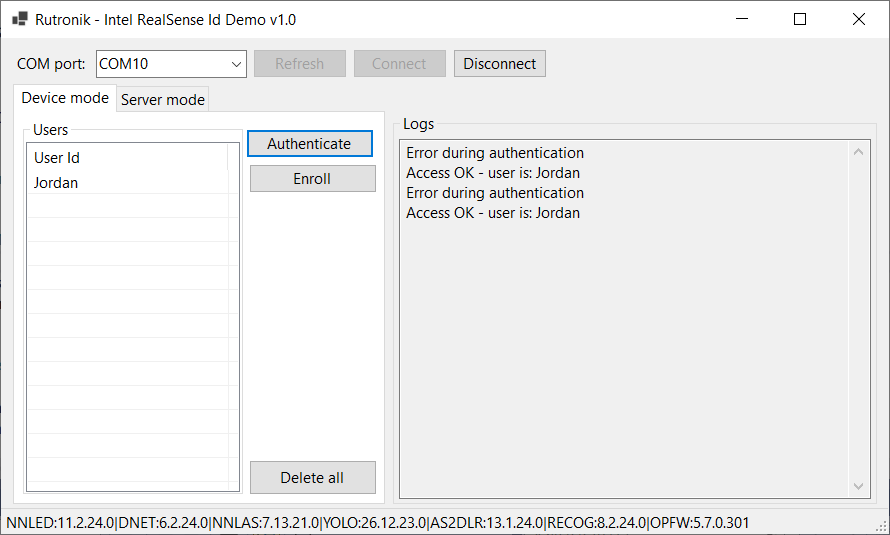
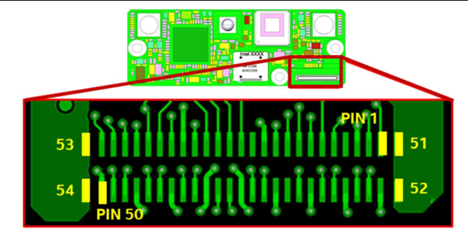
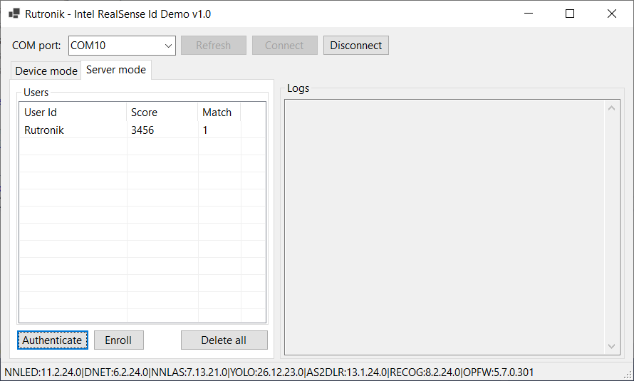
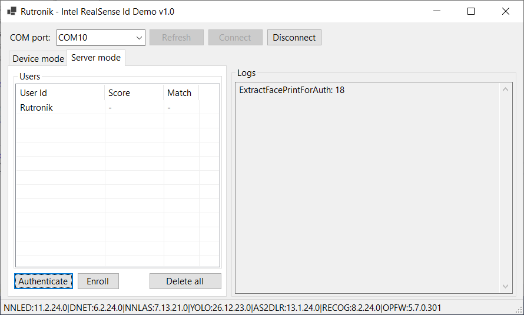

# USB UART for Intel RealSense ID camera

This code example enables to control (enroll user, authenticate user, read firmware version, ...) an Intel RealSense ID camera over USB.

The RDK2 is used as a USB to UART converter, since the Intel RealSense ID camera (F450/F455) can be controlled over UART.

Use the software located inside the gui/ directory to control the Intel RealSense ID camera.

The camera can be used in two modes: device mode or server mode.

In device mode, the Intel RealSense ID camera store the database of users. The camera directly inform over UART if the user is accepted or not.

In server mode, the database of users is stored somewhere else. The camera sends over UART a vector of information representing the user (transformation of picture into vector).

You can find an example of what is possible below:
 

## Requirements

- [ModusToolbox® software](https://www.infineon.com/cms/en/design-support/tools/sdk/modustoolbox-software/) **v3.x** [built with **v3.2**]
- [RDK2](https://www.rutronik24.fr/produit/rutronik/rdk2/16440182.html)
- Intel F455 module with UART signals exposed
- 3.3V power supply (or 5V to 3.3V DC/DC converter) enabling to deliver at least 1.5A

## Hardware diagram

 

 Following pins of the F455 should be connected:
 - PIN 52: VCC (3.3V) - Maximum current consumption arround 1.5A
 - PIN 51: GND
 - PIN 47: CPU_TXD2 (output of F455) -> should be connected to RX of RDK2
 - PIN 49: CPU_RXD2 (input of F455) -> should be connected to TX of RDK2

Following pins of the RDK2 should be connected:
- GND: P3.7 or P3.6 (should be connected to the PIN 51 of F455)
- ARD_UART_TX: P5.2 (should be connected to PIN 49 of F455)
- ARD_UART_RX: P5.1 (should be connected to PIN 47 of F455)

## Using the code example with a ModusToolbox™ IDE:

The example can be directly imported inside Modus Toolbox by doing:
1) File -> New -> Modus Toolbox Application
2) PSoC 6 BSPs -> RDK2
3) Sensing -> Intel RealSense ID camera USB gateway

A new project will be created inside your workspace.

To program the RDK2, use the Kit Prog3 USB connector.

## Operation

- First power ON the F455 module (3.3V)
- Then connected the RDK2 to your computer over USB
- Open the software located inside gui/ directory (C#/.NET needed)
- Select the correct COM port, connect, and then use the device

Below an example when using authentication in server mode.
The camera returns a match (0 or 1) per user, and a score (the highest the score, the most likely the user is).
 

Below another example (server mode), when performing authentication with a user that is not inside the database (returns error 18).
  

## Legal Disclaimer

The evaluation board including the software is for testing purposes only and, because it has limited functions and limited resilience, is not suitable for permanent use under real conditions. If the evaluation board is nevertheless used under real conditions, this is done at one’s responsibility; any liability of Rutronik is insofar excluded. 

